<h1 align="center">Hi, I'm Göktuğ 👋</h1>

  Robotics software engineer @ RB-Ware · Istanbul, Turkey 
  I build robots that perceive, decide and move safely: ROS 2, control, computer vision and deep learning, from simulation to real hardware.

  
  
  
  
  
  
  
  

---

### 🔧 What I work on

- 🦾 **Robot arm software @ RB-Ware**: ROS 2 hardware interfaces, freedrive and safety logic, tool changers, web-based operator UIs
- 🤖 **Autonomous systems**: navigation, SLAM, sensor fusion, coverage planning, fail-safe interlocks
- 🎛️ **Control**: PID / anti-windup, fuzzy logic, LQR, MPC, state-space modelling, system identification
- 👁️ **Computer vision**: semantic segmentation, multi-object tracking, camera calibration, RGB-D / stereo
- 🧠 **Deep learning**: Transformers (ViT, audio), LSTM forecasting, production ML systems
- 🏭 **Industrial automation**: Siemens S7-1200 PLCs, HMI / SCADA, VFDs, fieldbuses

### 🛠️ Toolbox

<b>Robotics</b> 

<b>Control</b> 

<b>Industrial automation</b> 

<b>Embedded</b> 

<b>Simulation & design</b> 

<b>Perception</b> 

<b>AI / ML</b> 

<b>Languages</b> 

<b>Web, cloud & tools</b> 

### 📌 Featured

- [**skycoat**](https://github.com/simaygoktug/skycoat): *MSc thesis.* Autonomous facade-climbing robot for high-rise painting, with semantic segmentation, closed-loop coverage planning, wall-plane state estimation, fail-safe interlocks and fault injection in ROS 2 + Gazebo
- [**robotics_and_control**](https://github.com/simaygoktug/robotics_and_control): Hybrid fuzzy-logic + PID navigation for a real mobile robot with 2D LiDAR, covering obstacle avoidance, wall following, corner turning and SLAM / AMCL
- [**mot**](https://github.com/simaygoktug/mot): ByteTrack with Hungarian matching and an improved Kalman filter, giving ~2× faster tracking with no meaningful MOTA loss
- **Audio-visual emotion recognition**: late-fusion Vision Transformer + audio Transformer, Log-Mel spectrograms, class-balanced focal loss, actor-disjoint validation
- [**CryptOn Forecast**](https://cryptontradebot.com): LSTM-based autonomous trading and market-intelligence platform on Flask + AWS, used by 113+ people in 10 countries
- [**magnetic_stirring_system**](https://github.com/simaygoktug/magnetic_stirring_system): Six-station lab stirrer with closed-loop PID speed / temperature control on Raspberry Pi and a Flask / React web UI
- [**embedded_programming_stm32**](https://github.com/simaygoktug/embedded_programming_stm32): Real-time STM32 firmware in C with FSM design, hardware timers and sensor I/O

### 💼 Experience

| | |
|---|---|
| **RB-Ware** · Robotics software engineer | present |
| **CryptOn Forecast** · Founder & AI software engineer | 2022 - present |
| **ERs Technology** · Software engineer | 2024 - 2025 |
| **BO Textile Group** · Control & automation engineer (intern) | 2025 |
| **Turkish Aerospace (TUSAŞ)** · System engineer (intern) | 2024 |
| **Mercedes-Benz Türk** · R&D engineer (intern) | 2023 |
| **Metadiag Automotive** · Embedded systems engineer (intern) | 2022 |

### 🎓 Education

- **MSc Intelligent Systems and Robotics**: University of Essex, UK · Distinction
- **BSc Mechatronics, Robotics and Automation Engineering**: Yıldız Technical University, Istanbul

### 📈 GitHub stats

  

### 📬 Reach me

  
  
  
  

